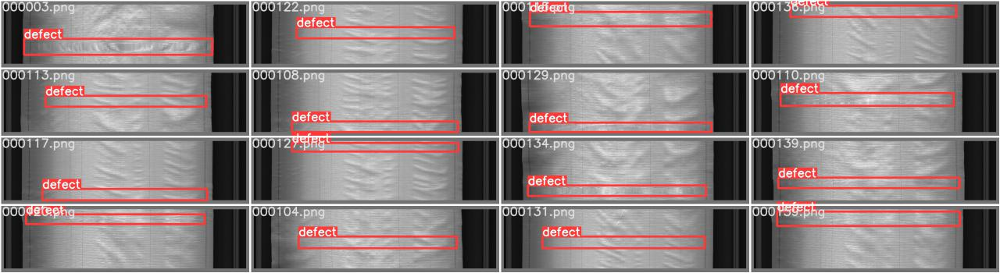
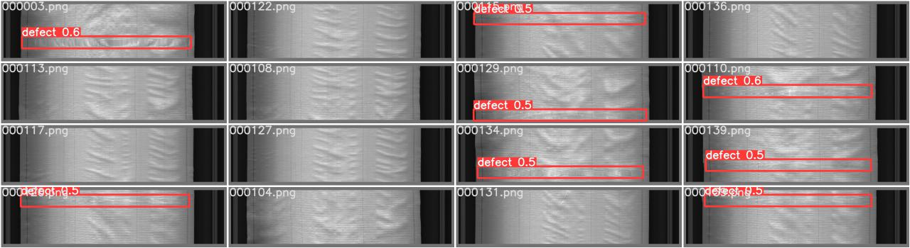

## Team Name: No Free Lunch

## Steps to run

1. Training

```
Command: python train.py --img <size of the image> --batch <batch size> --epoch <number of epoch> --data <path tp data.yaml> -- weights <name of the pretrained model> --adam --single-cls
Example: python train.py --img 1024 --batch 16 --epoch 80 --data data/defect.yaml -- weights yolov5m.pt --adam --single-cls
```

2. Validation

```
Command: python val.py --img <size of the image> --batch <batch size> --data <path tp data.yaml> -- weights <name of the pretrained model> --conf-thres <confidence threshold> --iou-thres <IoU-NMS threshold>
Example: python val.py --img 1024 --batch 16 --data data/defect.yaml -- weights yolov5m.pt --conf-thres 0.1 --iou-thres 0.5
```

3. Detection and Testing

```
Command: python detect.py --weights <path of the weights> --source <path of the test dataset> --imgsz <size of the image> --conf-thresh <confidence threshold> --iou-thres <IoU-NMS threshold> --view-img --save-txt
Example: python detect.py --weights best.pt --source test --imgsz 1024 --conf-thres 0.1 --iou-thres 0.5 --view-img --save-txt
```

4. Prepare CSV file

```
Command: python prepare_csv.py --label_path <path of the labels generated by detect.py> --test_path <path of the test dataset folder>
Example: python prepare_csv.py --label_path run/exp/detect --test_path test
```

## Points to be noted

1. DefectBoxes image_id centroid_X centroid_Y width height
2. DefectTypes defect_flag is 1 for defect and 0 for non defect
3. Optimizer: Adam
4. Loss: BinaryCrossEntropy
5. Augmentation Random Scaling, Mosaic, Random Cropping, Vertical and Horizontal Flip, Brightness and Saturation

## Input

Groundtruth



Prediction


